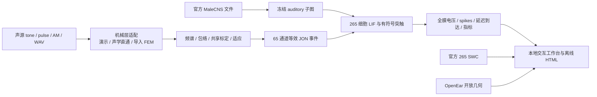

# 系统架构

## 架构范围

本系统运行于 Windows 的 H 盘项目目录，WSL 入口要求 `/mnt/h` 已挂载。现有 Python 环境可位于其他盘，持久数据、模型、缓存、临时文件及结果集中在 H 盘。用户提供的技术文档属于研究参考；执行范围由用户当前请求确定。



## 模块与职责

|模块|职责|
|---|---|
|`paths.py`、`config.py`|定位 H 盘项目，集中配置缓存/临时目录，读取 YAML|
|`bulk.py`、`malecns.py`|官方文件下载校验、节点注释、听觉 seeds 和邻域提取|
|`stimulus.py`、`fem_io.py`|刺激产生；机械响应 HDF5 契约及演示传递函数|
|`encoder.py`、`pipeline.py`|共享分位数标定、包络/适应编码、时间格独立采样、冻结输入与对照图|
|`snn.py`|单室 LIF、带符号权重和延迟、外部事件输入|
|`stage1.py`、`analysis.py`|实验执行、spikes 表、逐细胞/逐跳统计、latency|
|`signal_workbench.py`|完整声源实验调度；全细胞电压、模型到达事件及运行产物|
|`workbench_server.py`|127.0.0.1 HTTP API、任务串行执行、导入、报告导出|
|`workbench_template.html`|无 CDN 的交互绘图、参数控制、选边/时间轴/SWC/比较|
|`brain_report.py`、`connectome_experiment.py`|早期固定输入实验及脑模型离线报告|
|`provenance.py`|SHA-256、冻结清单核验、来源与依赖版本记录|

## 数据与时间契约

FEM HDF5 中四个等长、有限一维数组为 `stimulus/time_s`、`stimulus/pressure_Pa`、`fem/tm_displacement_m`、`fem/stapes_velocity_m_s`。时间从 0 开始、均匀采样；`metadata` 组属性包含 `sample_rate_hz`、非空 `fem_version`。单位分别为 s、Pa、m、m/s。工作台导入限制 20 MB、大于 0.4 且不超过 2 秒、各数组不超过 100,000 点。

标定 JSON 至少包含有限有序 `q_low`、`q_high` 及 `envelope_tau_ms: 5`。分位数来自共享参考/训练集的 log-envelope，测试刺激不单独拟合。真实 FEM 必须使用同物理量与单位的标定。默认演示标定不是生理标定。

当前声源默认 10 kHz、1 秒，200–800 ms 为 tone 等生成刺激窗口；WAV 使用前一秒并补零/重采样。仿真步长 0.1 ms，延迟对齐步长；电压在步骤结束每 0.2 ms 记录。内部 bodyId 排序与 Brian2 索引保持一致，HTML 中 bodyId 使用字符串避免大整数精度问题。

LIF 为 `dV/dt=(-60-V)/tau_m`，阈值 −50 mV，复位 −60 mV，不应期 2 ms。结构计数经 `log1p` 与中位数缩放转换成 ΔV，NT 先验决定符号。记录的前突触 spike 加实际突触延迟产生到达表；不是电缆传播求解或测得电流。

## HTTP 与任务执行

服务仅绑定 `127.0.0.1:8765`。GET 提供页面、bootstrap、任务状态、冻结实验和离线导出；POST 提供 `/api/run`、`/api/import-fem`。POST 需要本地 bootstrap 的会话 token，并检查 Host/Origin；不将 token 写入报告。只允许一个运行任务，避免 Brian2 全局 scope/时钟并发。

Brian2 首次导入在主线程执行，然后由单个工作线程运行。启动脚本以隐藏后台进程运行服务，并用 H 盘独立浏览器配置打开 Edge。服务 PID/URL 写入 `outputs/workbench/server.json`。

## 存储布局与 Git 边界

```text
ear_malecns_manual_project/
  .codex/project-rules.md   # 维护规则（提交）
  AGENTS.md                # Codex 规则入口（提交）
  src/ scripts/ tests/     # 源码、入口、检查（提交）
  configs/ docs/           # 配置与文档（提交）
  pyproject.toml           # 包与依赖声明（提交）
  data/raw/                # 官方原始数据（不提交）
  data/processed/          # 冻结连接图（不提交）
  fem/ skeletons/          # 几何、求解文件、SWC（不提交）
  downloads/ build/        # 缓存、下载、构建（不提交）
  outputs/workbench/       # 实验、导入、报告、日志（不提交）
```

每次实验创建唯一 `signal_*` 目录，保存机械 HDF5、calibration、固定输入 NPZ、spikes/到达 parquet、全电压 NPZ、指标 CSV、配置/实验 JSON 和 manifest。读取冻结实验时核验 manifest；额外导出 HTML 不改变原核心文件。

## 验证与扩展点

最近验收：35 项 Python 检查、9 项浏览器检查；HDF5 导入往返、同输入对照通过。测试覆盖幅度比例/静默、固定标定、非法参数、兴奋/抑制的延迟电压更新等。检查记录和截图留在 H 盘 `outputs/workbench`。

真实 FEM 使用现有适配契约替换演示层；生理标定和 AdEx 可扩展编码与神经元动力学层。三跳/更大图需重新冻结并评估资源；空间电缆方程需要单独模型，不能仅靠 SWC 着色声称实现。

## 2026-10-07 科研实验与可视化升级

新增 `research.py` 和 `scripts/23_run_research.py`，从 `configs/research_pilot.json` 执行固定图、多种子配对试验。声源层可按刺激窗口 RMS 缩放，特征层的固定共享标定不改变。时序空模型保留通道计数；结构对照复用冻结输入；JO-only 仅保留 JO→非 JO；统计先配对再 bootstrap。

`Engine(load_assets=False)` 省略批量实验不需要的几何读取；`simulate(record_voltage=False)` 保持相同放电和到达事件但省略电压监测。原工作台默认行为仍记录全电压。验证了两种记录模式 spike 表相同。

`research_report_template.html` 为自包含统计/术语报告；服务 `/research` 校验最新报告目录与 manifest 后返回页面。`outputs/research` 保存新批次，失败批次保留部分表，latest 只指向完成批次。

主工作台缓存强边排序和 Path2D 的 SWC 投影；只有视角、范围、选中细胞或尺寸改变才重建，时间播放只更新状态颜色。新增等 RMS 输入控件和中文术语区。

研究架构强调证据分层；更新图见 `research-pipeline.svg`，可编辑源为 `.mmd`。47 项 Python 检查、14 项浏览器检查通过。统计单位是运行种子，不是细胞或个体；图截断、预测递质、动力学和机械演示误差仍需独立验证。
